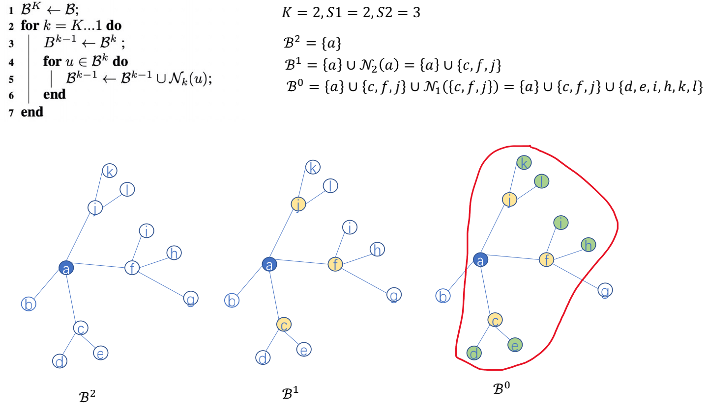
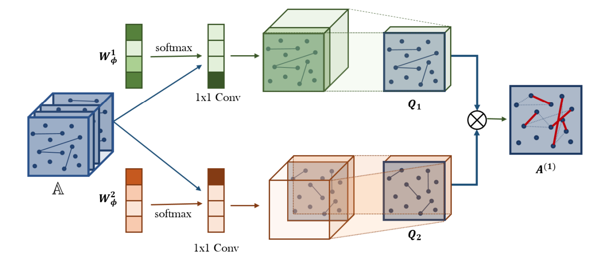
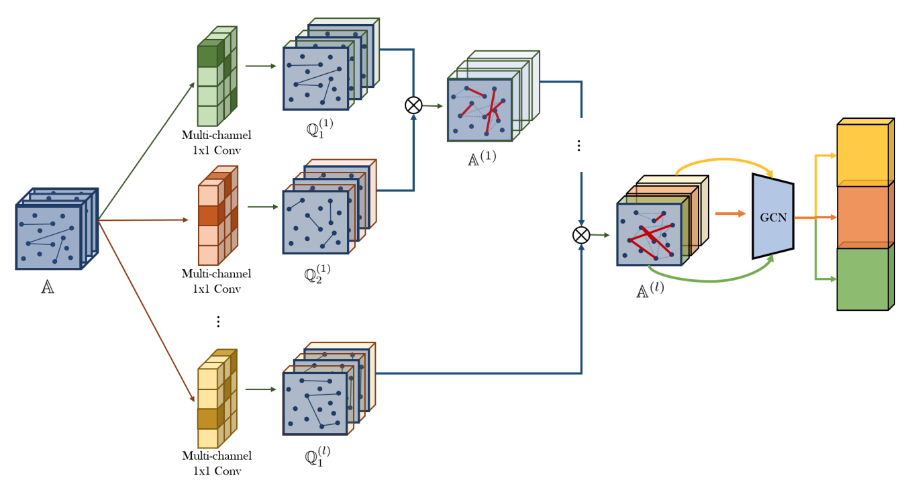
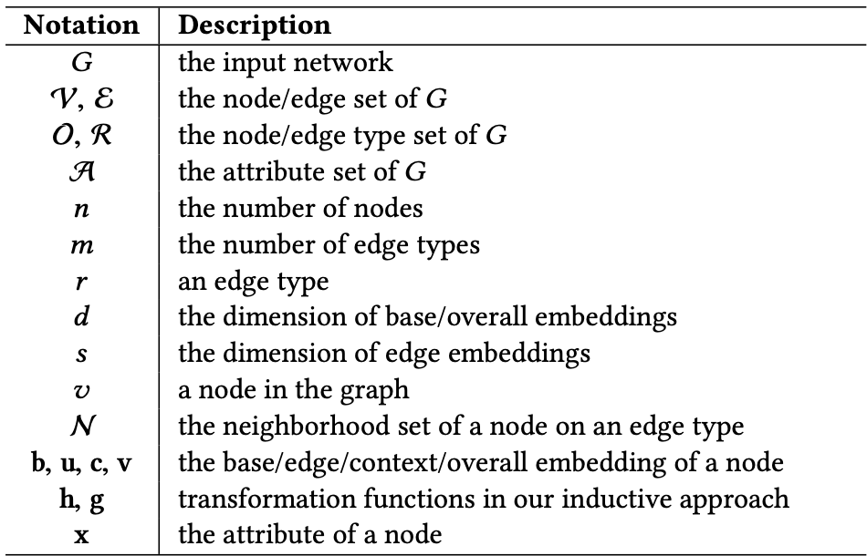
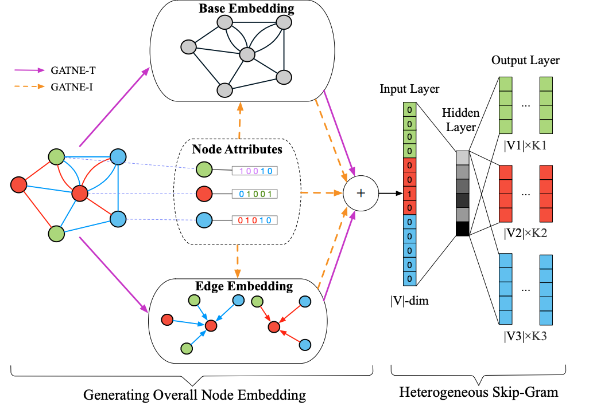
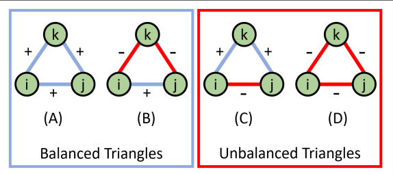
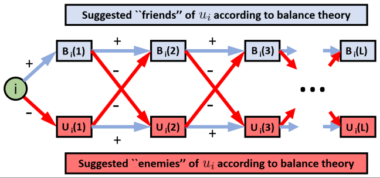
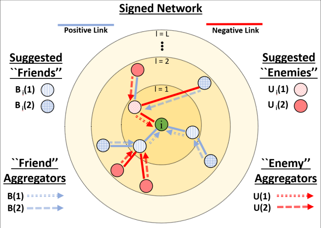
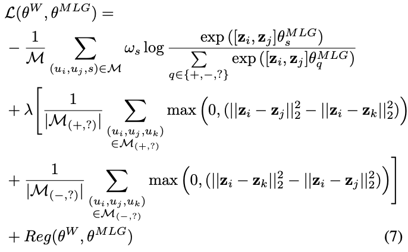

# gnn-study

用于记录自学 **图神经网络**。

## 目录

- [目录](#目录)
- [图的基础知识](#图的基础知识)
	- [图的类别]($图的类别) 
- [Graph Embedding](#Graph-Embedding)
	- [DeepWalk](#DeepWalk)
	- [LINE](#Line-Large-scale-Information-Network-Embedding)
	- [Node2vec](#Node2vec)
	- [Struc2vec](#Struc2vec)
	- [SDNE](#SDNE)
- [Graph Neural Network (GNN)](#Graph-Neural-Network-GNN)
	- [Graph Convolutional Network (GCN)](#Graph-Convolutional-Network-GCN)
	- [GraphSAGE](#GraphSAGE)
	- [Graph Attention Network (GAT)](#Graph-Attention-Network-GAT)
- [Heterogeneous Graph Attention Network (HAN)](#Heterogeneous-graph-attention-network-HAN)
- [Graph Transformer Networks (GTN)](#Graph-Transformer-Networks-GTN)
- [Metapath2Vec](#Metapath2Vec)
- [General Attributed Multiplex HeTerogeneous Network Embedding (GATNE)](#General-Attributed-Multiplex-HeTerogeneous-Network-Embedding-GATNE)
- [Bipartite Network Embedding (BiNE)](#Bipartite-Network-Embedding-BiNE)
- [参考链接](#参考链接)

## 图的基础知识

**图**

一张图是一个二元组 $G = (V, E)$，其中集合 $V$ 中的元素称为 **节点**，集合 $E$ 中的元素是两个节点组成的无序对，称为 **边**。

**图的分类**

有向图，无向图，混合图（边既可以有向也可以无向）。

**图的表示**

邻接表，邻接矩阵。

**度**

入度（箭头指入），出度（箭头指出）。

**子图**

对于图 $G$ 和图 $G^{'}$，若 $V(G^{'}) \subset V(G)$ 且 $E(G^{'}) \subset E(G)$，则称 $G^{'}$ 是 $G$ 的子图。

**连通图**

对于一个 **无向图**，如果任意的节点 $i$ 能够通过一些边到达节点 $j$，则称为连通图。

**有向图连通性**

- **强连通图**：任意两个节点互相对称可达的 **有向图**。
- **弱连通图**：任意两个节点至少单向可达的 **有向图**。

**图直径**

图中任意两点之间 **最短路径** 中的 **最长者**。

**度中心性 Degree Centrality**

用来刻画节点中心性的最直接度量，用来发现图中与其他关联最多的顶点。

$$
\text{norm(degree)} = \frac{\text{degree}}{N - 1}
$$

**中介中心性 Betweenness Centrality**

衡量顶点在图中担任 **桥梁** 角色的程度，即顶点出现在其他任意两个顶点对之间最短路径的次数。

$$
\text{betweenness} = \frac{经过该节点的最短路径次数}{C^2_N}
$$

**接近中心性 Closeness Centrality**

用于计算每个顶点到其他所有顶点的最短距离之和。

$$
\text{closeness} = \frac{n - 1}{节点到其他节点最短路径之和}
$$

**特征向量中心性**

测量节点对网络影响的方式。给定一个节点集合为 $|V|$ 的图 $G = (V, E)$，定义其 **邻接矩阵** 为 $A = (a_{v, t})$，当 $v$ 与 $t$ 相连时有 $a_{v, t} = 1$，否则 $a_{v, t} = 0$。则节点 $v$ 中心性 $x$ 的分数求解公式为：

$$
x_v = \frac{1}{\lambda}\sum_{t \in G}a_{v, t}x_t
$$

### 图的类别

- **异构图 (Heterogeneous Graph Neural Networks)**。即节点和边是有类别之分的，至少有两种及以上种类的边或至少有两种及以上种类的节点，也可以同时存在不同类别的边和节点。
- **二部图 (Bipartite Graph Neural Networks)**。即二分图，直观理解图分成左右两部分，两部分的节点之间可以相互连接，但同一边的节点之间一定没有连线。
- **多维图 (Multi-dimensional Graph Neural Networks)**。即两个节点间可能有多种关系的连线，例如人可以 "点击"，"购买"，"评论" 某商品。
- **符号图 (Signed graph)**。边上带有符号关系的图。例如 "点赞" 和 "点踩"。
- **超图 (Hypergraphs)**。一条边连接着两个及以上的节点。
- **动态图 (Dynamic Graphs)**。节点或边会随着时间的变化而变化。

## Graph Embedding

### DeepWalk

> 主要思想是在图结构上进行 **随机游走**，产生大量 **节点序列**，然后将这些序列作为训练样本输入 **word2vec** 进行训练，采用 **skip-gram** 算法，最大化随机游走序列的似然概率，并使用 **随机梯度下降** 学习参数，得到物品的 **embedding**。

### LINE: Large-scale Information Network Embedding

> 捕获节点的一阶和二阶相似度，分别求解，再将一阶二阶拼接在一起，作为节点的 embedding。

#### 一阶相似度

用于描述图中成对顶点之间的局部相似度。形式化描述为若 $u, v$ 之间存在直连边，则边权 $w_{uv}$ 即为两个顶点的相似度，若不存在直连边，则一阶相似度为 0。**仅能用于无向图**。

对于每一条无向边 $(i, j)$，顶点 $v_i, v_j$ 之间的 **联合概率** 是。其中，$\vec{u}_i$ 为顶点 $v_i$ 的低维向量表示。

$$
p_1 = \frac{1}{1 + \exp(-\vec{u}_i^T \cdot \vec{u}_j)}
$$

**经验分布** 为：

$$
\hat{p_1} = \frac{w_{ij}}{\sum_{(i, j) \in E} w_{ij}}
$$

常用指标是 **KL 散度**，则 **优化目标** 为 **最小化**：

$$
O_1 = d(\hat{p_1}(\cdot, \cdot), p_1(\cdot, \cdot)) = -\sum_{(i, j) \in E} w_{ij} \log p_1(v_i, v_j)
$$

#### 二阶相似度

用来表示 $u$ 与 $v$ 之间邻居节点相似情况。**可以用作有向图**。

对于有向边 $(i ,j)$，定义给定顶点 $v_i$ 条件下，产生上下文（邻居）顶点 $v_j$ 的概率是。其中，$|V|$ 是上下文顶点的个数。

$$
p_2(v_j | v_i) = \frac{\exp(\vec{u}_j^T \cdot \vec{u}_i)}{\sum_{k = 1}^{|V|} \exp(\vec{u}_k^T \cdot \vec{u}_i)}
$$

**优化目标** 是。其中 $\lambda_i$ 是控制节点重要性的因子，可以通过顶点的度数或 PageRank 等方法估计得到。

$$
O_2 = \sum_{i \in V} \lambda_i d(\hat{p}_2(\cdot | v_i), p_2(\cdot | v_i)) 
$$

**经验分布** 是。其中 $d_i$ 是顶点 $v_i$ 的 **出度**。

$$
\hat{p}_2 = (v_j | v_i) = \frac{w_{ij}}{d_i}
$$

使用 **KL 散度** 并且设 $\lambda_i = d_i$，忽略常数项，有：

$$
O_2 = - \sum_{(i, j) \in E} w_{ij} \log p_2(v_j | v_i)
$$

### Node2Vec

> 采用 **有偏向的随机游走** 策略来获取顶点的近邻序列，使用类似 skip-gram 方式生成节点 embedding。

给定当前顶点 $v$，访问下一个顶点 $x$ 的概率是。其中 $\pi_{vx}$ 是顶点 $v$ 和顶点 $x$ 之间的未归一化转移概率，$Z$ 是归一化常数。

$$
P(c_i = x | c_{i - 1} = v) =
\begin{cases}
\frac{\pi_{vx}}{Z} & \text{if} \ (v, x) \in E \\
0 & \text{otherwise} \\
\end{cases}
$$

引入两个超参数 $p$ 和 $q$ 来控制随机游走的策略，假设当前随机游走经过边 $(t, v)$ 到达顶点 $v$，设 $\pi_{vx} = \alpha_{pq}(t, x) \cdot w_{vx}$，$w_{vx}$ 是顶点 $v$ 和顶点 $x$ 之间的边权。

$$
\alpha_{pq}(t, x) = 
\begin{cases}
\frac{1}{p} & \text{if} \ d_{tx} = 0 \\
1 & \text{if} \ d_{tx} = 1 \\
\frac{1}{q} & \text{if} \ d_{tx} = 2 \\
\end{cases}
$$

$d_{tx}$ 是顶点 $t$ 和顶点 $x$ 之间的最短路径距离。

- $q$ 值小，则 **探索性强**。会捕获 **同质性节点**，即相邻接点表示相似，更像 **DFS**。
- $p$ 值小，则 **相对保守**。会捕获 **结构性**，即某些节点的图上结构，更像 **BFS**。

### Struc2Vec

> 通过比较两个顶点间距离为 $k$ 的环路上的有序度序列来层次化衡量结构相似度，对图的结构信息进行捕获，从而发掘节点间 **空间结构相似性**。当图的结构重要性大于邻居重要性时，有较好的效果。

- $R_k(u)$：到顶点 $u$ 距离为 $k$ 的 **顶点集合**。例如 $R_0(u)$ 即节点本身组成的集合，$R_1(u)$ 则是直接与节点相邻节点组成的集合。
- $s(S)$：顶点集合 $S$ 的 **有序度序列**。
- $f_k(u, v)$：顶点 $u$ 和顶点 $v$ 之间距离为 $k$ 的环路上的结构距离。

$$
f_k(u, v) = f_{k - 1}(u, v) + g(s(R_k(u)), s(R_k(v)))
$$

其中 $g(D_1, D_2) \geq 0$ 是衡量有序度序列 $D_1$ 和 $D_2$ 的距离函数，且 $f_{-1} = 0$。

- **Dynamic Time Warping (DTW)**：用来衡量两个不同长度且含有重复元素的序列的距离的算法。
- $d(a, b) = \frac{\max(a, b)}{\min(a, b)} - 1$：基于 **DTW** 的元素之间距离函数。
- $w_k(u ,v) = e^{-f_k(u ,v)}$：第 $k$ 层中顶点 $u$ 和 顶点 $v$ 的 **边权**。

通过 **有向边** 将 **属于不同层次的同一顶点** 连接起来，则不同层次同一顶点间的边权是。

$$
\begin{align}
w(u_k, u_{k + 1}) &= \log(\Gamma_k(u) + e) \\
w(u_k, u_{k - 1}) &= 1 \\
\end{align}
$$

- 采用 **随机游走**，每次采样的顶点更倾向于选择与当前节点结构相似的节点。

若决定在当前层游走，则从顶点 $u$ 到顶点 $v$ 的概率是。

$$
p_k(u, v) = \frac{e^{-f_k(u, v)}}{\sum_{v \in V, v \neq u} e^{-f_k(u, v)}}
$$

若决定切换不同的层，则以如下概率选择 $k + 1$ 层或 $k - 1$ 层。

$$
\begin{align}
p_k(u_k, u_{k + 1}) &= \frac{w(u_k, u_{k + 1})}{w(u_k, u_{k + 1} + w(u_k, u_{k - 1}))} \\
p_k(u_k, u_{k - 1}) &= 1 - p_k(u_k, u_k + 1) \\
\end{align}
$$

### SDNE

> 采用多个非线性层的方式捕获一阶二阶的相似性。

## Graph Neural Network (GNN)

### Graph Convolutional Network (GCN)

> 多层的图卷积神经网络，每一个卷积层仅处理一阶邻域信息，通过叠加若干卷积层可以实现多阶邻域的信息传递。

每一个 **卷积层的传播规则**是。

$$
H^{(l + 1)} = \sigma(\hat{D}^{-\frac{1}{2}}\hat{A}\hat{D}^{-\frac{1}{2}}H^{(l)}W^{(l)})
$$

- $\hat{A} = A + I_N$：无向图 $G$ 的邻接矩阵加上自连接，$I_N$ 是单位矩阵。
- $\hat{D}$ 是 $\hat{A}$ 的度矩阵，即 $\hat{D}_{ii} = \sum_j\hat{A}_{ij}$。
- $H^{(l)}$ 是第 $I$ 层的激活单元矩阵，$H^0 = X$。
- $W^{(l)}$ 是每一层的参数矩阵。

### GraphSAGE

> 通过学习一个对邻居节点进行聚合表示的函数来产生目标顶点的 embedding 向量。先采样邻居节点的向量信息，然后对这些信息进行聚合操作，最后和自己的信息进行拼接得到单个向量，并且 **训练权重函数** 来生成节点的 embedding。

#### 采样邻居节点

采样数量 **少于** 邻居节点数时，采用 **有放回** 抽样方法。采样数量 **多于** 邻居节点数时，采用 **无放回** 抽样方法。

**minibatch** 仅采样部分邻居节点，不使用全图信息，适用于大规模图训练。具体方式如下图：

#### 聚合拼接

$$
\begin{align}
h^k_{N(v)} & \leftarrow \text{AGGREGATE}_k(\{h^{k - 1}_u, \forall u \in N(v) \}) \\
h^k_v & \leftarrow \sigma(W^k \cdot \text{CONCAT}(h^{k - 1}_v, h^k_{N(v)})) \\
\end{align}
$$

**常用聚合函数**

- **MEAN aggregator**：将目标顶点和邻居顶点的 $k - 1$ 层向量 **拼接** 起来，然后对向量的每个维度进行 **求均值** 操作，将得到的结果做一次 **非线性变化** 产生目标顶点的第 $k$ 层表示向量。

$$
h^k_v \leftarrow \sigma(W \cdot \text{MEAN}(\{h^{k - 1}_v\} \cup \{h^{k - 1}_u, \forall u \in N(v) \}))
$$

- **Pooling aggregator**：先对目标顶点的邻结点表示向量进行一次非线性变换，之后再进行一次 pooling 操作（maxpooling 或 meanpooling），将得到结果与目标顶点的表示向量拼接，最后再进行一次非线性变换得到目标顶点的第 $k$ 层表示向量。

$$
\text{AGGREGATE}^{\text{pool}}k = \max(\{\sigma (W_{\text{pool}} h^k_{u_i} + b), \forall u_i \in N(v) \})
$$

- **LSTM aggregator**：有更强的表达能力，但不是输入对称的，所以使用时需要对顶点的邻句 **乱序**。

#### 参数学习

无监督学习。基于图的损失函数希望 **临近的节点具有相似的向量表示**，同时让 **分离的节点表示尽可能区分**。目标函数如下：

$$
J_G(z_u) = -\log (\sigma (z_u^T z_v)) - Q \cdot E_{v_n \sim P_n(v)} \log(\sigma (-z_u^T z_{v_n}))
$$

其中，$v$ 是通过 **固定长度的随机游走** 出现在 $u$ 附近的节点，$p_n$ 是负采样的概率分布，$Q$ 是负样本数量。

### Graph Attention Network (GAT)

$$
\alpha_{ij} = \frac{\exp(\text{LeakyReLU}(\vec{a}^T[W \cdot \vec{h}_i \| W \cdot \vec{h}_j])}{\sum_{k \in \N_i} \exp(\text{LeajyReLU}(\vec{a}^T [W \cdot \vec{h}_i \| W \cdot \vec{h}_k])}))
$$

$$
\vec{h^{'}_i} = \sigma(\sum_{j \in N_i} \alpha_{ij} \cdot W \cdot \vec{h_j})
$$

$W$ 为 **训练的权重**，$\|$ 表示将两个向量 **拼接** 在一起。即我们先求出目标节点和某邻居节点之间的 $\alpha$ 系数，然后对目标节点的所有邻居节点进行 **特征结合**，迭代求出下一轮目标节点的表示向量。

**多头注意力机制** 使用不同参数重复训练多次拼接成一个大矩阵。

$$
\vec{h^{'}_i} = \|^K_{k = 1} \sigma(\sum_{j \in N_i} \alpha_{ij}^k \cdot W^k \cdot \vec{h_j})
$$

在最后的预测层则直接在向量的每个位置 **取平均值** 得到节点的最终特征。

$$
\vec{h^{'}_i} = \sigma(\frac{1}{K} \sum^K_{k = 1}\sum_{j \in N_i} \alpha_{ij}^k \cdot W^k \cdot \vec{h_j})
$$

## Heterogeneous graph attention network (HAN)

> 基于 **注意力机制** 的 **异构图** 神经网络，利用 **语义级别注意力** 和 **节点级别注意力** 来同时学习 **元路径** 和 **节点邻居** 的重要性，并通过相应地 **聚合** 操作得到最终的节点表示。

### 基础知识

#### 异构图

定义异构图为 $g = (V, E)$ 由节点的集合 $V$ 和节点之间的边 $E$ 组成。异构图与 **节点类型的映射函数** $\phi: V \rightarrow A$ 以及 **连接类型的映射函数** $\psi: E \rightarrow R$ 相关联。$A$ 和 $R$ 是预先定义好的节点的类型和连接的类型，其中 **$|A| + |R| \geq 2$**。

#### Meta-Path

格式是 $A_1 \stackrel{R_1}{\rightarrow} A_2 \stackrel{R_2}{\rightarrow} \cdots \stackrel{R_l}{\rightarrow} A_{l + 1}$，描述了节点 $A_1$ 和 节点 $A_l$ 之间的一个 **组合关系** $R = R_1 \circ R_2 \circ \cdots \circ R_l$。

例如可以通过 电影 - 时间 - 电影 来定义一个 Meta-Path，从而将同一年的电影进行关联，并在这种 Meta-Path 下形成一条两个电影之间的边。

### Node-Level Attention

不同类别的节点 $\phi_i$ 可能有 **不同维度的特征向量**，所以需要先通过 **转换矩阵$M_i$** 将他们映射到 **相同维度**。设转换前的特征向量为 $h_i$，转换后的特征向量为 $h_i^{'}$。

$$
h_i^{'} = M_{\phi_i} \cdot h_i
$$

然后使用 **自注意力机制** 学习 **每个节点的权值**，对于给定的 **节点对** $(i, j)$，他们之间通过 meta-path $\phi$ 连接，他们之间的 **节点注意力值** $e_{ij}^{\phi}$ 表示节点 $j$ 对节点 $i$ 的重要性。

$$
e_{ij}^{\phi} = \text{att}_{\text{node}}(h_i^{'}, h_j^{'}; \phi) = \sigma(a_\phi^T \cdot [h_i^{'} \| h_j^{'}]).
$$

其中 $\text{att}_{\text{node}}$ 表示 **节点级别** 的 attention，对于同一个 meta-path $\phi$ 下的目标节点，其邻居节点的权值是 **共享的**。$\sigma$ 是激活函数，$\|$ 是拼接操作，$a_\phi$ 是节点级别的 attention 向量。然后通过 softmax 操作得到每个特征向量的 **权值系数**。

$$
\alpha_{ij}^\phi = \text{softmax}(e_{ij}^\phi) = \frac{\exp(\sigma(a_\phi^T \cdot [h_i^{'} \| h_j^{'}]))}{\sum_{k \in N_i^\phi} \exp(\sigma(a_\phi^T \cdot [h_i^{'} \| h_k^{'}]))}
$$

最后，节点 $i$ 最终的 embedding 计算方式如下。

$$
z_i^\phi = \sigma(\sum_{j \in N_i^\phi} \alpha_{ij}^\phi \cdot h_j^{'})
$$

节点的类别可能会非常多，所以引入 **多头注意力机制**。

$$
z_i^\phi = ||^K_{k = 1}\sigma(\sum_{j \in N_i^\phi} \alpha_{ij}^\phi \cdot h_j^{'})
$$

### Semantic-Level Attention

语义级别的 Attention 将不同类型的连接的 embedding 组合起来。假设每个类别的权值为 $\beta$，它的计算方式抽象为。

$$
(\beta_1, \beta_2, \cdots \beta_P) = \text{att}_\text{sem}(Z_{\phi_1}, Z_{\phi_2}, \cdots, Z_{\phi_P})
$$

其中 $\text{att}_\text{sem}$ 目的是 **学习每种边类型的重要性**。

$$
w_\phi = \frac{1}{|V|}\sum_{i \in V}q^T \cdot \tanh(W \cdot z_i^\phi + b)
$$

其中 $q$ 是语义级别的 Attention 向量，$W$ 是权值矩阵，$b$ 是偏置向量，都是 **需要学习的**，且对于所有的 meta-path 都是 **共享的**。通过 softmax 作用便可以得到每个 meta-path 类别的 Attention 权值。

$$
\beta_\phi = \frac{\exp(w_{\phi_i})}{\sum^P_{i = 1}\exp(w_{\phi_i})}
$$

最终，根节点的嵌入表示。

$$
Z = \sum^P_{i = 1}\beta_{\phi_i} \cdot Z_{\phi_i}
$$

### Loss Function

HAN 是一个 **半监督模型**。我们根据数据集中有的 **有标签数据**，使用 **误差反相传播算法** 对模型进行训练，使用 **交叉熵损失函数**。

$$
L = -\sum_{l \in y_L} Y^l \ln(C \cdot Z^l)
$$

其中，$C$ 是分类器的参数，$y_L$ 是有标签的节点，$Y^l$ 和 $Z^l$ 是有标签数据的标签值和预测值。

## Graph Transformer Networks (GTN)

> 通过自动学习异构图并生成不同长度的 **meta-path**，再结合传统的 **GCN** 算法以端到端的方式来学习图上有效的节点表示。

[Graph Transformer Networks](https://arxiv.org/pdf/1911.06455.pdf)

### Meta-Path 生成

$\tau^v$ 和 $\tau^e$ 分别代表 **节点类型集合** 和 **边类型集合**。假设异构图 $G = (V, E)$，则有 **节点类型映射函数** $f_v: V \rightarrow \tau^v$ 和 **边类型映射函数** $f_e: E \rightarrow \tau^e$。$N = |V|$ 是 **节点数量**。我们也可以用一堆 **邻接矩阵** $\{A_k\}^K_{k = 1} \text{where} \ K = |\tau^e| $ 来表示这张异构图，也可以写作 $A \in R^{N \times N \times K}$。我们还有一个 **特征矩阵** $X \in R^{N \times D}$ 来表示每个节点的原始特征。

首先使用不同卷积核对 **邻接矩阵** $A$ 做卷积。其中 $\phi$ 是卷积层，而 $W_\phi$ 是相应的参数。

$$
Q = \phi(A; \text{softmax}(W_\phi))
$$

然后，通过将邻接矩阵相乘来计算某种 meta-path 的矩阵，并使用度矩阵对其正则化以保证稳定性。

$$
A^{l} = D^{-1}Q_1Q_2
$$

任意长度 $l$ 的邻接矩阵可以这样计算。$A_P$ 可以看做是 **所有长度为 $l$ 的元路径邻接矩阵的加权和**。

$$
A_P = (\sum_{t_1 \in \tau^e} \alpha^{(1)}_{t_1}A_{t_1})(\sum_{t_2 \in \tau^e}\alpha^{(2)}_{t_2}A_{t_2}) \cdots (\sum_{t_l \in \tau^e}\alpha_{t_l}^{(l)}A_{t_l})
$$

这样很容易将 **短的 meta-path** 忽略，因此将 **单位矩阵** 进来 $A_0 = I$。

### 多通道

GT 层产生一组 meta-path后，通过多个不同的图结构学习不同节点，在 $l$ 个 GT 层堆积之后，将 **GCN** 应用于元路径张量 $A^l \in R^{N \times N \times C}$ 的每个通道，并将多个节点表示 **拼接** 起来成 $Z$。并使用 **交叉熵损失函数** 来训练。

$$
Z = \|^C_{i = 1} \sigma(\hat{D}_i^{-1} \hat{A}_i^{(l)} X W)
$$

## Metapath2Vec

> 专注于 **异构网络**，使用 **基于 meta-path 的随机游走策略** 来构建每个顶点的异构邻域，再使用 **Skip-Gram** 模型来完成顶点的嵌入。

[metapath2vec: Scalable Representation Learning for
Heterogeneous Networks](https://dl.acm.org/doi/pdf/10.1145/3097983.3098036)

### metapath2vec 框架

对于一个 **同构网络** $G = (V, E)$，目标是从每个顶点的局部领域 **最大化网络似然**。

$$
\arg \underset{\theta}{\max} \prod_{v \in V} \prod_{c \in N(v)} p(c | v; \theta)
$$

其中，$N(v)$ 表示顶点 $v$ 的邻域，$p(c | v; \theta)$ 表示给定顶点 $v$ 后顶点 $c$ 的条件概率。

而 metapath2vec 主要分为 **Meta-Path-Based Random Walks** 和 **Heterogeneous Skip-Gram** 两个部分。

#### Meta-Path-Based Random Walks

> 一种异构网络上的随机游走方式。

一个异构网络 $G = (V, E, T)$ 和一个 meta-path 的 scheme $P$ 定义如下。

$$
V_1 \stackrel{R_1}{\rightarrow} V_2 \stackrel{R_2}{\rightarrow} \dots V_t \stackrel{t}{\rightarrow} V_{t + 1} \dots V_{l - 1} \stackrel{R_{l - 1}}{\rightarrow} V_l
$$

在第 $i$ 步的转义概率定义如下。

$$
p(v^{i + 1} | v_t^i, P) = 
\begin{cases}
\frac{1}{| N_{t + 1}(v_t^i) |} & (v^{i + 1}, v^i) \in E, \phi(v^{i + 1}) = t + 1 \\
0 & (v^{i + 1}, v^i) \in E, \phi(v^{i + 1}) \neq t + 1 \\
0 & (v^{i + 1}, v^i) \in E \\
\end{cases}
$$

其中。$v_t^i \in V_t$，$N_{t + 1}(v_t^i)$ 表示顶点 $v_t^i$ 的 $V_{t + 1}$ 类型的邻域顶点集合。直观理解就是在预定义的 meta-path scheme $P$ 条件下进行 **有偏游走**。

且 meta-path 常常以对称方式使用，即顶点 $V_1$ 的类型和 $V_l$ 的类型相同。

$$
p(v^{i + 1} | v_t^i) = p(v^{i + 1} | v_l^i), \text{if} \ t = 1
$$

这样保证不同烈性顶点之间的语义关系可以适当融入 Skip-Gram 模型中去。

#### Heterogeneous Skip-Gram

> 使用 **Skip-Gram** 模型通过在顶点 $v$  的邻域 $N_t(v), t \in T_v$ 上 **最大化条件概率** 来学习异构网络 $G = (V, E, T)$ 上的顶点表征。

$$
\arg \underset{\theta}{\max} \sum_{v \in V}\sum_{t \in T_v}\sum{c_t \in N_t(v)} \log p(c_t | v; \theta)
$$

$p(c_t | v; \theta)$ 通常定义为 $softmax$ 函数。

$$
p(c_t | v; \theta) = \frac{e^{X_{c_t} \cdot X_v}}{\sum_{u \in V} e^{X_u \cdot X_v}}
$$

其中 $X_v$ 是矩阵 $X$ 的第 $v$ 行矩阵，表示顶点 $v$ 的 **嵌入向量**。为了 **提高参数更新效率**，采用 **Negative Sampling** 进行 **参数迭代更新**，给定一个 Negative Sampling 的大小 M，参数更新过程如下。

$$
\log \sigma(X_{t_t} \cdot X_v) + \sum^M_{m = 1}E_{u^m \sim P(u)}[\log \sigma(-X_{u^m} \cdot X_v)]
$$

其中 $\sigma = \frac{1}{1 + e^{-x}}$，$P(u)$ 是一个 **Negative Node $u^m$** 的**预定义分布**。

metapath2vec 通过 **不考虑** 顶点的类型进行节点抽取来确定当前顶点概率。

### metapath2vec++

> 在 softmax 环节考虑顶点类型，从而在 Negative Sampling 环节采样时考虑顶点类型。

softmax 函数 **根据不同类型的顶点** 的上下文 $c_t$ 进行归一化。

$$
p(c_t | v; \theta) = \frac{e^{X_{c_t} \cdot X_v}}{\sum_{u_t \in V_t} e^{X_{u_t} \cdot X_v}}
$$

最终得到的目标函数是。

$$
O(X)= \log \sigma(X_{c_t} \cdot X_v) + \sum^M_{m = 1}E_{u_t^m \sim P_t(u_t)}[\log\sigma(-X_{u_t^m} \cdot X_v)]
$$

## General Attributed Multiplex HeTerogeneous Network Embedding (GATNE)

> 解决了 AMHEN 图网络，其包含**不同类型的节点**，相邻节点之间有**不同类型的边**，且每个节点有多个属性值。

**AMHEN** 是 _Attributed Multiplex HEterogeneous Network_ 的缩写，对于这种图网络的研究有几大难点：

- **多类型边**：每个节点对之间都有可能有多条不同类型的边，这些信息需要被充分考虑。
- **观察不全面**：实际数据往往是观察不全面的，常规的神经网络嵌入算法无法解决 **长尾** 和 **冷启动** 的问题。
- **可拓展性**：实际数据往往巨大无比，这就非常考验算法对大的神经网络的适应性和拓展性了。

基于此，我们提出了 **GATNE** 方法，它**正式定义了多属性多类型的异构图嵌入问题**，且支持 **转换型** 和 **归纳型** 两种嵌入方式，而且其中的算法非常 **高效**（时间复杂度较低，有利于解决超大规模图网络）。

### 基本定义

- **图网络** $G = (V, E)$，$V$ 是 $n$ 个节点的集合，$E$ 是边的集合。每条边 $e_{ij} = (v_i, v_j)$ 都有一个权重 $w_{ij} \geq 0$，表示连接的两个节点之间相关性强弱。实际问题中，如果 $G$ 是有向图，则 $e_{ij} \neq e_{ji}$ 并且 $w_{ij} \neq w_{ji}$。如果 $G$ 是无向图，则 $e_{ij} \equiv e_{ji}$ 且 $w_{ij} \equiv w_{ji}$。具体符号定义如下：

- **异构图** $G = (V, E)$ 有一个 **节点类型映射函数** $\phi: V \rightarrow O$ 和一个 **边类型映射函数** $\psi: E \rightarrow R$。$O$ 和 $R$ 分别代表所有结点类型的集合、所有边类型的集合。异构图必须满足 $|O| + |R| \gt 2$。
- **属性图** $G = (V, E, A)$，每一个节点 $v_i \in V$ 都有一个关联的属性数组，$A = {x_i | v_i \in V}$ 是所有结点的节点属性的集合，$x_i$ 就是节点 $v_i$ 对应的属性数组。
- **属性化多路异构图** $G = (V, E, A), E = \bigcup_{r \in R} E_r$，其中 $E_r$ 包含了所有类型是 $r \in R$ 的边。我们可以根据边类型将这个图划分成多个子图 $G_r = (V, E_r, A)$。

### Transductive Model: GATNE-T

对于某个特定节点 $v_i$ 和每种类型的边 $r$，将 _embedding_ 分成 _base embedding_ 和 _edge embedding_。其中，_base embedding_ 会被不同类型的边 **共享**，而 _k-th level edge embedding_ $u_{i, r}^{(k)} \in R^s$ 则是从 **邻居节点** 进行 **聚合** 而来：

$$
u_{i, r}^{(k)} = \text{aggregator}({u_{j, r}^{(k - 1)}, \forall v_j \in N_{i, r}})
$$

其中 $N_{i, r}$ 是节点 $v_i$ 通过 $r$ 类型的边连接的邻居节点的集合。初始化的 $u_{i, r}^{(0)}$ 是随机生成的，而 $\text{aggregator}$ 函数可以是 **mean aggregator** 或者 **max-pooling aggregator**：

$$
u_{i, r}^{(k)} = \sigma(\hat{W}^{(k)} \cdot \text{mean}(\{u_{j, r}^{(k - 1)}, \forall v_j \in N_{i, r} \})) \quad \text{mean aggregator} \\
u_{i, r}^{(k)} = \max(\{\sigma(\hat{W}_{pool}^{(k)} u_{j, r}^{(k - 1)} + \hat{b}_{pool}^{(k)}), \forall v_j \in N_{i, r} \}) \quad \text{max-pooling aggregator} \\
$$

其中 $\sigma$ 是 **激活函数**，我们将所有 level 的 _edge embedding_ 拼接起来，得到 $U_i$：

$$
U_i = (u_{i, 1}, u_{i, 2}, \dots, u_{i, m}).
$$

利用 **自注意力机制** 计算 $U_i$ 中每个元素对应的系数 $a_{i, r} \in R^m$：

$$
a_{i, r} = \text{softmax}(w_r^T \tanh(W_rU_i)^T)
$$

$w_r$ 和 $W_r$ 是可训练的系数，大小分别是 $d_a$ 和 $d_a \times s$，$s$ 是 $U_i$ 的维度。最终，我们得到特定节点针对某种边类型的总的 _embedding_是：

$$
v_{i, r} = b_i + \alpha_r M_r^T U_i a_{i, r}
$$

其中，$b_i$ 是节点 $v_i$ 的 _base embedding_，$alpha_r$ 是表示 _edge embedding_ 对于总的 _embedding_ 的重要性的 **超参数**，$M_r \in R^{s \times d}$ 是 **可训练** 的 **转移矩阵**。

### Inductive Model: GATNE-I

由于 GATNE-T 只是将现有数据进行转换，因此无法处理新的数据，而 GATNE-I 便是从现有数据中学习某种规律，并将其转换成函数表示，因此对于新的数据也可以很好地处理。

我们定义 _base embedding_ $b_i = h_z(x_i)$，其中 $h_z$ 是 **转换函数**，$z = \phi(i)$ 是节点 $v_i$ 的节点类型，初始化的 $u_{i, r}^{(0)} = g_{z, r}(x_i)$ 也是一个转换函数。

最终，我们还加入了额外的属性贡献，得到：

$$
v_{i, r} = h_z(x_i) + \alpha_r M_r^T U_i a_{i, r} + \beta_r D_z^T x_i
$$

其中 $\beta_r$ 是一个参数，$D_z$ 是一个对应于节点特征 $z$ 的转换矩阵。

GATNE-T 和 GATNE-I **本质区别** 在于：

- 在 GATNE-T 中，_base embedding_ $b_i$ 和 _initial edge embedding_ $u_{i, r}^{(0)}$ 是直接根据网络结构对每个节点进行训练得到的，因此无法处理新的节点。
- 在 GATNE-I 中，我们则训练一个 **转换函数** $h_z$ 和 $g_{z, r}$，这两个函数可以将原始特征 $x_i$ 映射成 $b_i$ 和 $u_{i, r}^{(0)}$，因此可以处理新的节点。

### 模型优化

使用 **meta-path-based 随机游走** 来生成节点序列，使用 _skip-gram_ 算法对生成的节点序列学习得到 _embeddings_。转移概率是：

$$
p(v_j | v_i, T) =
\begin{cases}
\frac{1}{|N_{i, r} \cap V_{t + 1}|} & (v_i, v_j) \in E_r, v_j \in V_{t + 1} \\
0 & (v_i, v_j) \in E_r, v_j \notin V_{t + 1} \\
0 & (v_i, v_j) \notin E_r \\
\end{cases}
$$

所以，给定节点 $v_i$ 和它的语境 $C$，我们需要最小化它的负采样对数概率：

$$
-\log P_\theta (\{v_j | v_j \in C\} | v_i) = \sum_{v_j \in C} - \log P_\theta(v_j | v_i) \\
$$

其中，$\theta$ 是所有的参数，我们采用异构的 _softmax_ 函数进行标准化，最终得到：

$$
E = -\log\sigma(c_j^T \cdot v_{i, r}) - \sum^L_{l = 1} E_{v_k \sim P_t(v)} [\log \sigma (-c_k^T \cdot v_{i, r})]
$$

其中，$\sigma(x) = 1 / (1 + \exp(-x))$ 是 _sigmoid_ 函数，$L$ 是负采样样本数量，而 $v_k$ 是从节点 $v_j$ 的对应节点集 $V_t$ 上定义的噪声分布 $P_t (v)$ 中随机抽取的。

我们的随机游走算法 **时间复杂度** 是 $O(nmdL)$，$n$ 是节点数量，$m$ 是边类型数，$d$ 是总的 _embedding_ 的长度大小，$L$ 是负采样样本数量。**空间复杂度** 是 $O(n(d + m \times s))$，$s$ 是 _edge embedding_ 的长度大小。

## Bipartite Network Embedding (BiNE)

> 进行有 **目的性** 的随机游走生成节点序列，然后设计一种同时考虑显式关系和隐式关系的新型优化框架，来表示学习节点的表示。

- **显示关系** 是指能从数据集中直接获得的关系信息，如图中可直接观测到的边信息。
- **隐式关系** 是指数据中隐含的关系信息，例如两个节点没有直接边连接，但通过某个节点间接连接在一起，那么可以认为这两个节点之间具有隐式关系。

### 问题定义

给定异构图 $G = (U, V, E)$，$U$ 和 $V$ 分别表示两种类型节点的集合，而 $E$ 表示边集合，再给出边的权重矩阵 $W$。需要求出一个映射函数 $f: U \cup V \rightarrow R^d$，从而将图中每个节点映射到一个 $d$ 维的嵌入数组。

### BiNE 模型

一个好的 embedding 需要能够重建原来的图网络，因此我们从 **显式关系和隐式关系** 两个方面来重构原始的二分图学习，并将学习到的 embedding 结合起来学习到最终的节点表示。

#### 显式关系

对显式关系的建模，考虑两个已有连接边的节点，其 **连接概率** 定义为

$$
P(i, j) = \frac{w_{ij}}{\sum_{e_{ij} \in E} w_{ij}}
$$

显然，两节点之间边的权重值越大，概率值越大。参考 word2vec 向量内积思想，将两个节点的嵌入在空间内的相似度表示为

$$
\hat{P}(i, j) = \frac{1}{1 + \exp(-\vec{u_i}^T\vec{v_j})}
$$

然后使用 KL 散度来衡量俩分布的差异并以最小化为目标，即显式关系的目标函数是

$$
\text{minimize} \quad O_1 = \text{KL}(P\|\hat{P}) = \sum_{e_{ij} \in E} P(i, j) \log(\frac{P(i, j)}{\hat{P}(i, j)}) \\

\propto - \sum_{e_{ij} \in E} w_{ij} \log\hat{P}(i, j)
$$

直观理解是，对于两个相连紧密的节点，学习到的两个节点在低位向量空间中的表示也是靠近的，即保持了 **局部临近性**。

#### 隐式关系

隐式关系相对于同类型节点而言，面对大规模的二分图，需要用到 DeepWalk 中的随机游走，生成两个包含不同类型节点的语料库。

1. 构建顶点序列的语料库

将二分图 **拆分成两个同质网络**，定义两个同类型节点的二阶相似度为

$$
w_{ij}^U = \sum_{k \in V} w_{ik}w_{jk} \\
w_{ij}^V = \sum_{k \in U} w_{ki}w_{kj} \\
$$

这样得到两个同质网络的权重矩阵，大小分别为 $| U | \times |U|$，$|V| \times |V|$。

然后我们在这两个同质网络的权重矩阵运行 **截断随机游走**，引入 **偏置** 和 **自适应** 的随机游走产生器，具体参照规则如下

- 对于每个节点，其 **中心性** 越强，从它开始的随机游走序列越多。
- 选定一个 **概率值**，使得随机游走会在某一步随机地停止，得到长度不同的节点序列。

2. 建模隐式关系

在上述生成的两个语料库中分别使用 Skip-Gram 模型来学习节点的表示，目标函数如下

$$
\text{maximize} \quad O_2 = \prod_{u_i \in S \and S \in D^U} \prod_{u_c \in C_S(u_i)} P(u_c | u_i) \\
P(u_c | u_i) = \frac{\exp(\vec{u_i}^T\vec{\theta_c})}{\sum^{|U|}_{k = 1} \exp(\vec{u_i}^T\vec{\theta_k})}
$$

$S$ 为语料库中的节点序列，$C_S(u_i)$ 是在该序列中节点 $u_i$ 的上下文节点集合。

由于计算 $P$ 的时候采用了 $\text{softmax}$ 函数，复杂度太高，因此采用 **负采样** 方法来逼近这个函数。

3. 负采样

采用 **局部敏感哈希** 算法，给出 $N_S^{ns}$ 表示在序列 $S \in D^U$ 中节点 $u_i$ 的 $ns$ 负采样样本，则我们近似 $p(u_c | u_i)$ 为

$$
p(u_c, N_S^{ns}(u_i) | u_i) = \prod_{z \in \{u_c\} \cup N_S^{ns}(u_i)} P(z | u_i) 
$$

其中 $P(z | u_j)$ 是

$$
P(z | u_i)
\begin{cases}
\sigma(\vec{u_i}^T\vec{\theta_z}), & \text{if } z \text{ is a context of } u_i \\
1 - \sigma(\vec{u_i}^T\vec{\theta_z}), & z \in N_S^{ns}(u_i) \\
\end{cases}
$$

其中 $\sigma = \frac{1}{1 + e^{-x}}$。

#### 联合优化

分别通过显式关系和隐式关系得到节点表示，然后我们需要将这两者结合起来形成最终的节点表示，最终的目标函数公式是

$$
\text{maximize} \quad L = \alpha\log O_2 + \beta\log O_3 - \gamma O_1
$$

使用 SGA 来优化这个函数，因为优化这个函数的不同部分需要不同的训练实例，所以 **分布优化**。

首先优化 **显式关系**，更新节点公式为

$$
\vec{u_i} = \vec{u_i} + \lambda\{\gamma w_{ij}[1 - \sigma(\vec{u_i}^T \vec{v_j})] \cdot \vec{v_j}\}, \\
\vec{v_j} = \vec{v_j} + \lambda\{\gamma w_{ij}[1 - \sigma(\vec{u_i}^T \vec{v_j})] \cdot \vec{u_i}\}, \\
$$

然后优化 **隐式关系**，公式如下

$$
\vec{u_i} = \vec{u_i} + \lambda\{\sum_{z \in \{u_c\} \cup N_S^{ns}(u_i)} \alpha[I(z, u_i) - \sigma(\vec{u_i}^T \vec{\theta_z})] \cdot \vec{\theta_z} \} \\
\vec{v_j} = \vec{v_j} + \lambda\{\sum_{z \in \{v_c\} \cup N_S^{ns}(v_j)} \beta[I(z, v_j) - \sigma(\vec{v_j}^T\vec{\theta_z^{'}})] \cdot \vec{\theta_z^{'}} \}
$$

其中 $I(z, u_i)$ 决定节点 $z$ 是否为 $u_i$ 的上下文节点，**上下文向量** 的更新公式如下

$$
\vec{\theta_z} = \vec{\theta_z} + \lambda\{\alpha[I(z, u_i) - \sigma(\vec{u_i}^T\vec{\theta_z})] \cdot \vec{u_i} \}, \\
\vec{\theta_z^{'}} = \vec{\theta_z^{'}} + \lambda\{\beta[I(z, v_j) - \sigma(\vec{v_j}^T\vec{\theta_z^{'}})] \cdot \vec{v_j} \}, \\
$$

## [Signed Graph Convolutional Network](https://arxiv.org/pdf/1808.06354.pdf?ref=https://githubhelp.com)

将 GCN 框架运用到有权图中存在两个问题，第一是如何正确处理负权边，因为它们的属性和正权边完全不同，第二是如何将正权和负权边相互结合形成节点的表示。

所以根据 **平衡理论**，定义了 **平衡路径**，以此为基础提出 **SGCN**。直观来说，平衡理论就是朋友的朋友是朋友，朋友的敌人是敌人，敌人的朋友是敌人，敌人的敌人是朋友。据此，我们将带权图周期分类为 **平衡** 或 **不平衡**。平衡的周期包括 **偶数条** 负链接，不平衡的周期包括 **奇数条** 负连接。

并且我们按照路径的长度做出划分，$B_i(1)$ 就代表节点 $i$ 的直接连接的平衡节点（即权值为正），而 $B_i(2)$ 则代表节点 $i$ 的直接连接的非平衡节点（即权值为负）。以此类推，$B_i(2)$ 就代表节点 $i$ 的朋友的朋友和敌人的敌人。

因此，我们推导出通过 $l$ 条路径的朋友或敌人的公式是

$$
B_i(l) = 
\begin{cases}
\{u_j | u_j \in N_i^+\} & l = 1 \\
\{u_j | u_k \in B_i(l - 1) \text{ and } u_j \in N_k^+\} \cup \{u_j | u_k \in U_i(l - 1) \text{ and } u_j \in N_k^-\}  & l > 1 \\
\end{cases}
$$

$$
U_i(l) = 
\begin{cases}
\{u_j | u_j \in N_i^-\} & l = 1 \\
\{u_j | u_k \in U_i(l - 1) \text{ and } u_j \in N_k^+ \} \cup \{u_j | u_k \in B_i(l - 1) \text{ and } u_j \in N_k^-\} & l > 1 \\
\end{cases}
$$

在 SGCN 中，信息的传递和聚合，每层将维持两个表达：一个对应节点的平衡邻居集合，另一个对应不平衡邻居集合。所以每一层的聚合函数也分为两个部分，针对任意的节点 $u_i$，第一层卷积聚合（即 $l = 1$）如下：

$$
h_i^{B(1)} = \sigma(W^{B(1)}[\sum_{j \in N_i^+} \frac{h_j^{(0)}}{|N_i^+|}, h_i^{(0)}]) \\
h_i^{U(1)} = \sigma(W^{U(1)}[\sum_{k \in N_i^-} \frac{h_k^{(0)}}{|N_i^-}, h_i^{(0)}]) \\
$$

当模型网络深度增加时，聚合函数会更加复杂，当 $l > 1$ 时的聚合函数是：

$$
h_i^{B(l)} = \sigma(W^{B(l)}[\sum_{j \in N_i^+} \frac{h_j^{(B(l - 1))}}{|N_i^+|}, \sum_{k \in N_i^- }\frac{h_k^{U(l - 1)}}{|N_i^-|}, h_i^{B(l - 1)}]) \\
h_i^{U(l)} = \sigma(W^{U(l)}[\sum_{j \in N_i^+} \frac{h_j^{U(l - 1)}}{|N_i^+|}, \sum_{k \in N_i^-} \frac{h_k^{(B(l - 1))}}{|N_i^-|}, h_i^{U(l - 1)}]) \\
$$

基于此，SGCN 在训练过程中，希望分类节点之间的连接关系，并且运用平衡理论让有正边连接的节点要比没有边连接的节点要比有负边连接的节点的距离更进。目标函数设计为：

## 参考链接

[零基础多图详解图神经网络（GNN/GCN）](https://www.youtube.com/watch?v=sejA2PtCITw)

[【图神经网络】GNN从入门到精通](https://www.bilibili.com/video/BV1K5411H7EQ?p=2)

